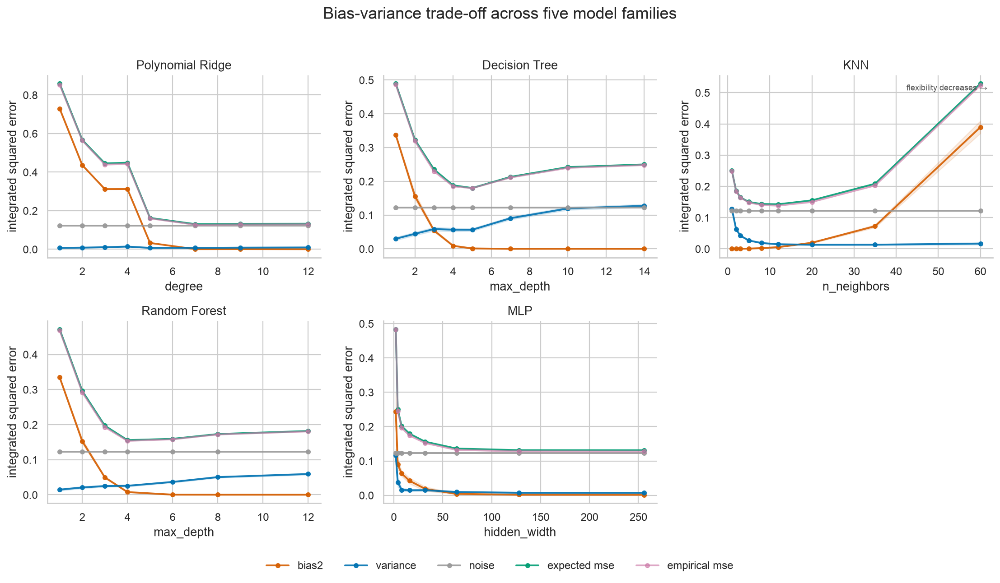

# Bias-Variance Decomposition

Исследовательский проект о том, как сложность регрессионной модели, размер
обучающей выборки и наблюдаемый шум влияют на bias, variance и итоговую
квадратичную ошибку.



## Математическая идея

Для squared loss используется разложение

```text
E[(Y - f_hat_D(X))²] = Bias² + Variance + Noise
```

На синтетических данных известны истинная функция и дисперсия шума. Это
позволяет оценить все компоненты через Monte Carlo и сравнить их сумму с
empirical MSE.

В исследовании используются следующие модели

- Polynomial Ridge
- Decision Tree
- KNN
- Random Forest
- MLP

## Основные результаты

| Модель | Лучшая сложность | Bias² | Variance | Expected MSE |
| --- | --- | --- | --- | --- |
| Polynomial Ridge | degree=7 | 0.001 | 0.007 | 0.130 |
| KNN | n_neighbors=12 | 0.006 | 0.014 | 0.143 |
| MLP | hidden_width=64 | 0.010 | 0.012 | 0.145 |
| Random Forest | max_depth=4 | 0.008 | 0.025 | 0.156 |
| Decision Tree | max_depth=5 | 0.002 | 0.055 | 0.180 |

Для дерева глубины 6 увеличение train size с 40 до 320 объектов уменьшает
variance примерно с 0.130 до 0.049.

На Diabetes минимальный средний RMSE среди рассмотренных фиксированных
конфигураций показывает Ridge со значением 54.86. Результаты Linnerud имеют
большую неопределённость из-за размера выборки в 20 наблюдений.

## Структура

```text
research.ipynb
report/
    report.tex
    report.pdf
reports/
    figures/
    tables/
scripts/
    run_experiments.py
    build_report.py
src/bias_variance_project/
    core.py
    experiments.py
    plotting.py
tests/
```

`core.py` содержит генерацию синтетических данных и прямую реализацию
Monte Carlo decomposition. `experiments.py` содержит функции отдельных
исследовательских вопросов. `plotting.py` строит графики из полученных
результатов.

## Установка

Требуются Python 3.11 или 3.12, [uv](https://docs.astral.sh/uv/) и XeLaTeX.

```bash
git clone git@github.com:Mr-Nick14/Bias-Variance-Decomposition.git
cd Bias-Variance-Decomposition
uv sync --locked --all-groups
```

## Запуск

Полный пересчёт таблиц и графиков

```bash
uv run python scripts/run_experiments.py
```

Быстрый smoke run

```bash
uv run python scripts/run_experiments.py --fast
```

Выполнение notebook сверху вниз

```bash
uv run jupyter execute research.ipynb --inplace
```

Сборка PDF из `report/report.tex`

```bash
uv run python scripts/build_report.py
```

Пересчёт экспериментов перед сборкой PDF

```bash
uv run python scripts/build_report.py --refresh
```

Те же команды доступны через `make install`, `make run`, `make notebook`
и `make report`.

## Протокол случайности

Train data, model initialization, test noise, bootstrap и CV splits используют
разные seed schedules. При сравнении моделей используются одинаковые Monte
Carlo train samples и одинаковые bootstrap resamples.

Random Forest и MLP получают новый model seed в каждом повторении. Поэтому их
variance включает изменение обучающей выборки и stochasticity алгоритма.
Test noise не зависит от train noise. Evaluation grid никогда не передаётся в
`fit`.

## Реальные данные

Diabetes и Linnerud загружаются из scikit-learn без сетевого доступа.
Используются исходные признаки без дополнительного feature engineering.
Масштабирование Ridge и MLP выполняется внутри sklearn Pipeline на каждом
CV fold.

Bootstrap-анализ реальных данных не является точным классическим разложением.
`bootstrap_variance` измеряет чувствительность к перевыборке.
`proxy_bias2` вычисляется относительно Gradient Boosting reference model.

## Проверки

```bash
uv run pytest
uv run ruff check .
```

Тесты проверяют воспроизводимость, формы данных, независимые seed schedules,
приближённое равенство decomposition, конечность таблиц и создание основных
CSV и PNG.

## Ограничения

- Monte Carlo оценки зависят от конечного числа повторений
- Оси сложности разных семейств нельзя сравнивать напрямую
- Variance Random Forest и MLP включает stochasticity алгоритма
- На реальных данных неизвестны истинная функция и irreducible noise
- Proxy bias зависит от выбранной reference model
- Выводы по реальным данным относятся к фиксированным конфигурациям
- Linnerud слишком мал для устойчивого ранжирования моделей
